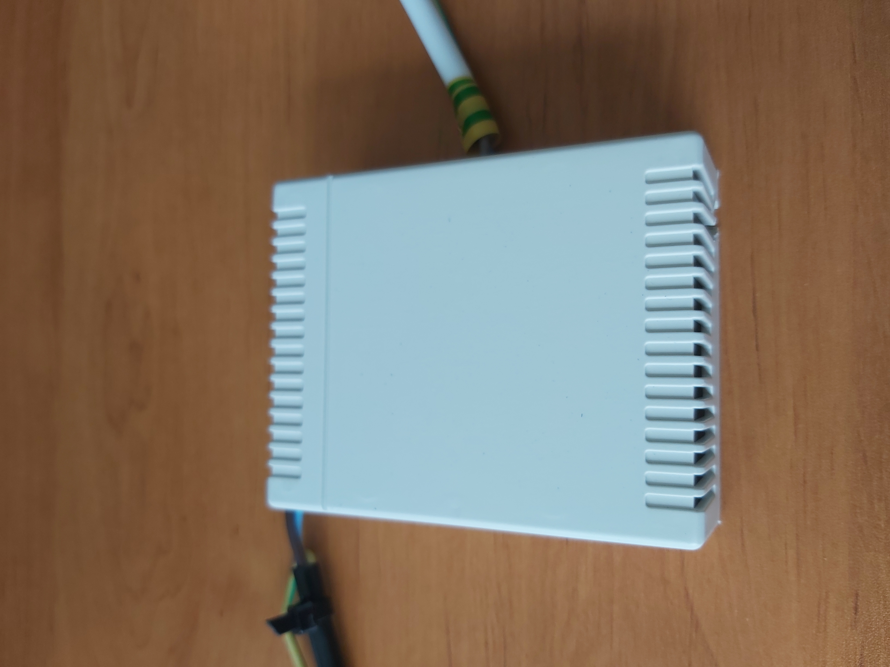
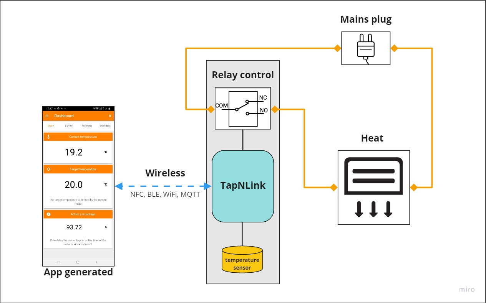
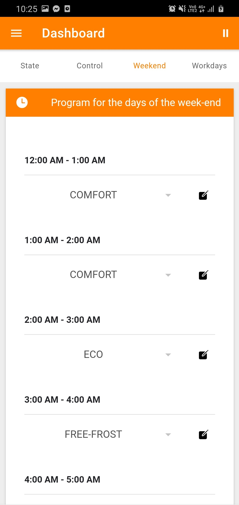

# ThermosTap

This article presents a simple connected sensor temp based on a TapNLink module. The only 'processor' is the Java Virtual Machine embedded into the TapNLink module that runs a simple Java program. 

>> Note: if you wish to understand how works TapNLink and the associated tools (IoTize Studio), see [Getting Started](http://docs.iotize.com/GettingStarted/).

To find the project on GitHub, [it's here](https://github.com/iotize-sas/Open-Projects/tree/main/ThermosTap-demo) !

>> This project has realised with REVA card for this example. Also, you can easily craft your circuit with main components.

It's composed of 4 folders:

- `app_generated/ThermosTap.apk`: Source for the mobile application. It was auto generated by IoTize mobile app build server.
- `java/ThermosTap.java`: Contains a Java code which will be executed by the `JVM`.
- `iotize_studio/ThermosTap.iotz`: IoTize Studio configuration file to configure the TapNLink for the demo.
- `doc`: Contains a pictures and java code readme file.

## The main components

If you wish to purchase the main components follow these links:
- TapNLink (the communication module), [it's here](https://www.digikey.fr/product-detail/fr/iotize/TNL-FIT203/2087-TNL-FIT203-ND/12397002).
- BL0937 (the power sensor), [it's here](https://www.aliexpress.com/wholesale?catId=0&initiative_id=SB_20210218083908&isPremium=y&SearchText=bl0937).
- the plastic enclosure, [it's here](https://www.aliexpress.com/item/4000287507400.html?spm=a2g0o.productlist.0.0.309d44dfcbyy66&algo_pvid=642dec70-5635-4468-b159-30d6b13c2028&algo_expid=642dec70-5635-4468-b159-30d6b13c2028-3&btsid=2100bb5116136655014285201e8088&ws_ab_test=searchweb0_0,searchweb201602_,searchweb201603_).

## How it works

    <em>Physical view</em>

The temp sensor has relied to IN1 on REVA card, then the in1 output has connected to POT to recovery the value on Pin PB3.
The led switch has define by the Pin A2, this one has directly connected to LED2.

## Overview

    <em>General view of the project</em>

## Java code

In the `Java` code executed by the `JVM`, the `onCheck()` method is call periodically (the period is specify in the `TapNLinkVar` constructor). In this method, we get an image of the power by considering the differences of the pulses counts during the elapsed time. 

- To find more `Java` code information, [it's here](https://github.com/iotize-sas/Open-Projects/tree/main/ThermosTap-demo/doc/Java_code/Java_code.md) !

## IoTize Studio

1. Open `iotize_studio/ThermosTap.iotz` with IoTize Studio. For more information about Studio, see [it's here](http://docs.iotize.com/UserManuals/IotizeStudio/).
2. On `IoTize_Studio/Tap`, define `User internal JVM` on `Yes` and select the `.java` file path `java/ThermosTap.java`.
3. On Studio execute `java` build for generate `.bcb` file. 
4. Configure your `TapNLink` with `IoTize Studio` :
    -  [Setup connection to your Tap](http://docs.iotize.com/UserManuals/DiverseTools/)
    -  [Setup IoT Platform (MQTT) information](http://docs.iotize.com/Technologies/AWSIot/).
    -  Click on `Configure` button and wait for the end of the configuration process. 
5. Reboot the tap to apply the new configuration. 

## Running the 'ThermosTap' app

- Because the App has not been published onto the stores, you have to install it manually, see [it's here](https://github.com/iotize-sas/Open-Projects/tree/main/ThermosTap-demo/app_generated/ThermosTap.apk).
- Once your circuit is properly connect, and your TapNLink configured, you can launch the mobile app. The fastest way consists in approach your mobile phone (with NFC enabled) to the plastic enclosure. The NFC will launch the app and connect automatically to the TapNLink. 
- Thanks to the `TapNLink`you can now monitor the target and current temperature. 

    <em>Viewing the application</em>

## Control the active mode

You can activate any mode, but if `Auto recovery` mode is active then at the next time change the mode will be set to `AUTO`.

    <em>Select mode</em>

## Control the mode's temperature

The temperatures for each mode can be changed using a slider.

    <em>Mode's temperature slider</em>

## Define hysteresis

You can modify the hysteresis according to the connected device to avoid a change between the on/off too frequent.

    <em>Hysteresis slider</em>

## Define the day's status

You must define the status of each day, if it is to be considered as a working day or weekend day

    <em>Days status</em>

## Program your days

Set the mode for each day type

    <em>Week end program</em>

