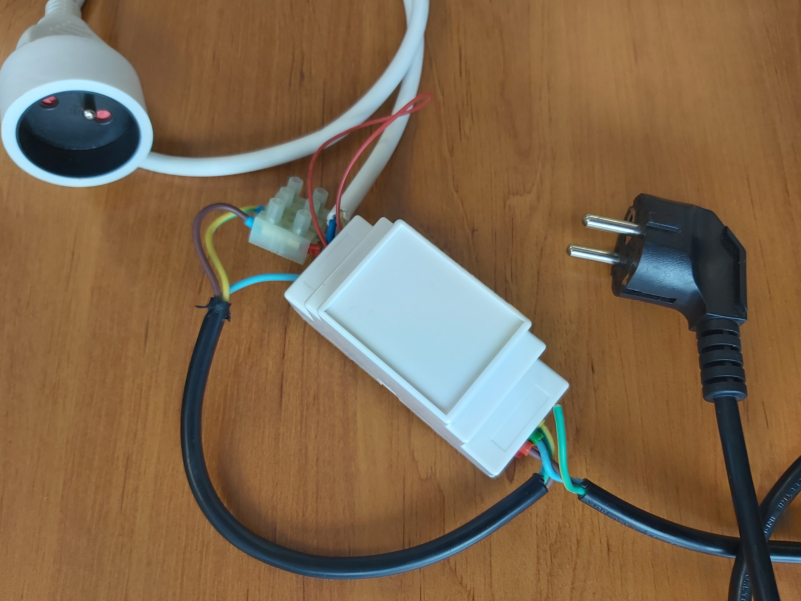
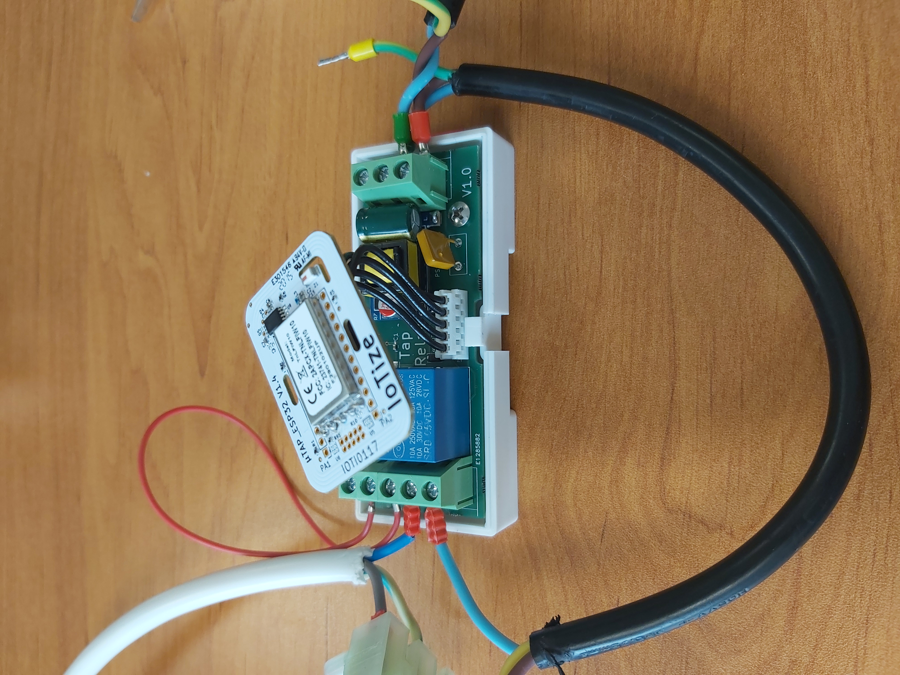
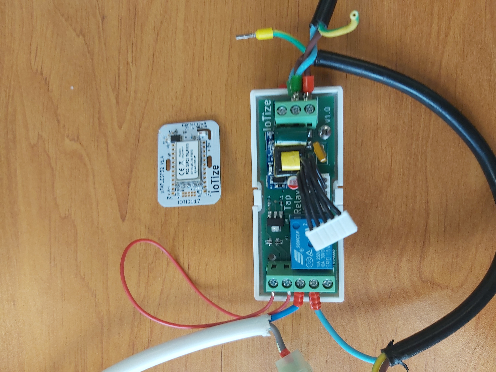
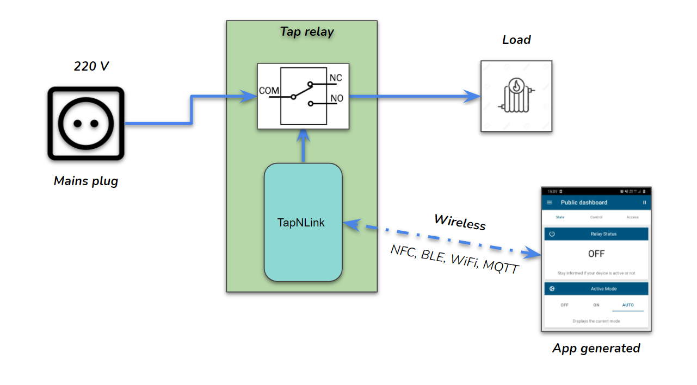
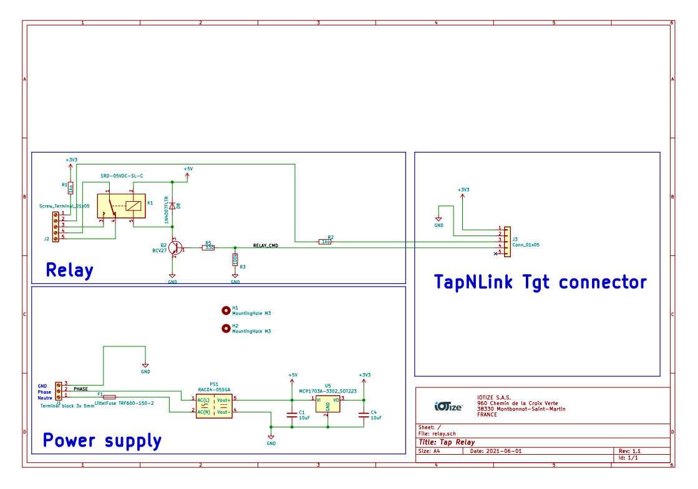
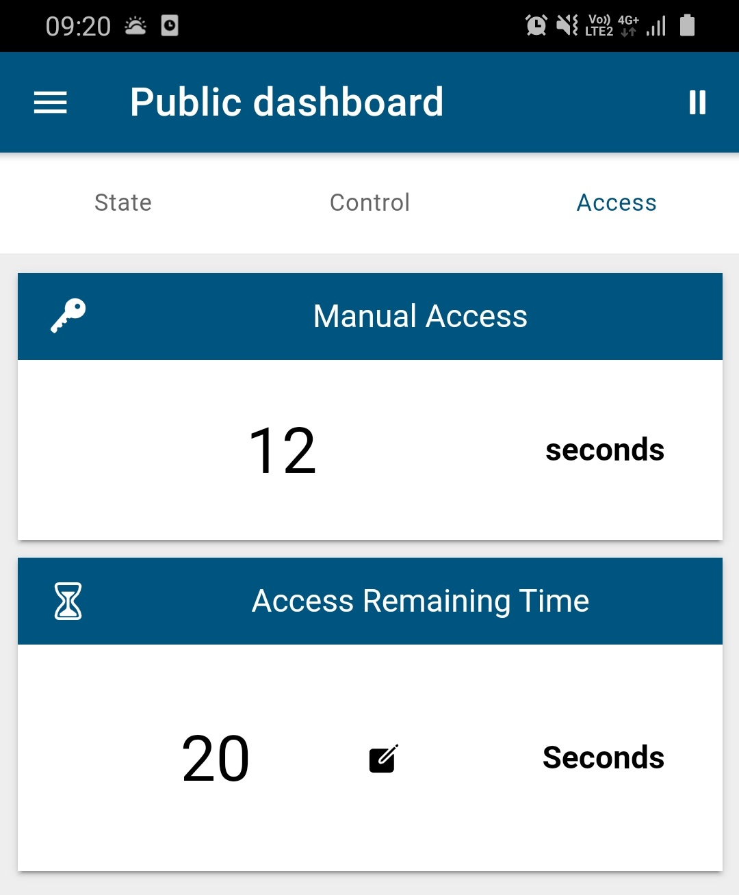
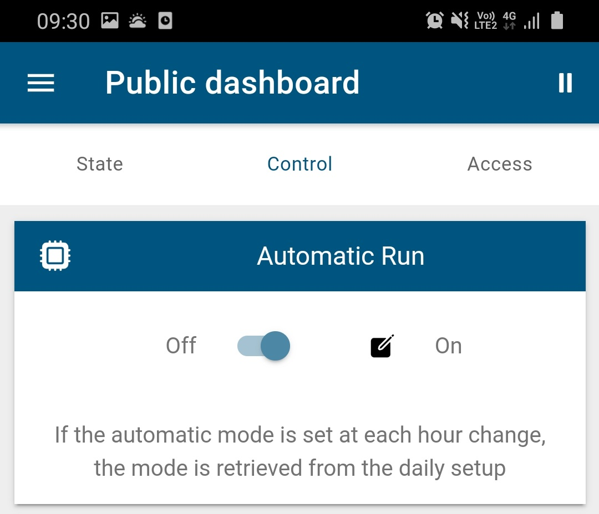

# TimerSwitch

In this article we will show how to define relay state from the TapNLink.
The only 'processor' is the Java Virtual Machine embedded into the TapNLink module that runs a simple Java program. 

>> Before this project you must know the IoTize tools with [Getting Started](http://docs.iotize.com/GettingStarted/).

To find the project on GitHub, [it's here](https://github.com/iotize-sas/TimerSwitch-demo) !

It's composed of 4 folder:

- `app_generated/TimerSwitch.apk`: Source for the mobile application. It was auto generated by IoTize mobile app build server.
- `java/TimerSwitch.java`: Contains a Java code which will be executed by the `JVM`.
- `iotize_studio/WattTap.iotz`: IoTize Studio configuration file to configure the TapNLink for the demo.
- `doc`: Contains a pictures and java code documentation.

## The main components

If you wish to purchase the main components follow these links:
- TapNLink (the communication module), [it's here](https://www.digikey.fr/product-detail/fr/iotize/TNL-FIT203/2087-TNL-FIT203-ND/12397002).

- the plastic enclosure, [it's here](https://www.aliexpress.com/item/4000287507400.html?spm=a2g0o.productlist.0.0.309d44dfcbyy66&algo_pvid=642dec70-5635-4468-b159-30d6b13c2028&algo_expid=642dec70-5635-4468-b159-30d6b13c2028-3&btsid=2100bb5116136655014285201e8088&ws_ab_test=searchweb0_0,searchweb201602_,searchweb201603_).

## How it works

Below a few pictures. An extension cord has been cut and each half has been connected to the board.

    <em>Assembly of the relay</em>

The relay acts as a spy between the mains plug and the load.

    <em>Inside of the case</em>

In the plastic case, the TapNLink module is linked with a small ribbon cable.

    <em>Tap relay</em>

The relay element switch ON/OFF the device current. 

## Overview

    <em>General view of the project</em>

## Schematic

    <em>Electric diagram</em>

## Java code

The `Java` code embedded in the `JVM` will allow us to make a `onCheck()` method call every time (This time is defined in a `TapNLinkVar` constructor). In this onCheck() method, by verifying that the passed `id` corresponds to the desired one, we will be able to perform data recovery tasks, also `TapNLinkVar` value updates or send MQTT message.

- To find more `Java` code information, [it's here](https://github.com/iotize-sas/TimerSwitch-demo/blob/master/doc/Java_code/Java_code.md) !

## IoTize Studio

1. Open `iotize_studio/TimerSwitch.iotz` with IoTize Studio. For more information about Studio, see [it's here](http://docs.iotize.com/UserManuals/IotizeStudio/).
2. On `IoTize_Studio/Tap`, define `User internal JVM` on `Yes` and select the `.java` file path `java/TimerSwitch.java`.
3. On Studio execute `java` build for generate `.bcb` file. 
4. Configure your `TapNLink` with `IoTize Studio` :
    -  [Setup connection to your Tap](http://docs.iotize.com/UserManuals/DiverseTools/)
    -  Click on `Configure` button and wait for the end of the configuration process. 
5. Reboot the tap to apply the new configuration. 

## Running the 'TimerSwitch' app

- Because the App has not been published onto the stores, you have to install it manually, see [it's here](https://github.com/iotize-sas/TimerSwitch-demo/blob/master/app_generated/TimerSwitch.apk).
- Once your circuit is properly connect, and your TapNLink configured, you can launch the mobile app. The fastest way consists in approach your mobile phone (with NFC enabled) to the plastic enclosure. The NFC will launch the app and connect automatically to the TapNLink. 
- Thanks to the `TapNLink`you can now monitor the relay status, that have been stored into the module. 

    <em>Viewing the application</em>

## Active mode

The mode definition allows to force an on/off or to set to auto and allow the system to manage its state with the daily setup

    <em>Define state</em>

## Manual turn ON

The manual turn ON has priority than an active mode. Then when you press the button, the device turn ON during time define on Access Bundle.

 

 
 

 

     <em>Manual access progress</em>
 

 
 ## Automatic run
 
This option allows you to return to the AUTO mode each time change. If the ON a mode has forced, then at the next hour if this mode is active the device will switch to AUTO.

 

 
 

 

     <em>Return to AUTO mode</em>
 
